# Marching Cubes
## [Goal] The implementation Marching Cubes using OpenCV in C++ 
- Example pointcloud 
   <table>
      <tr>
         <td>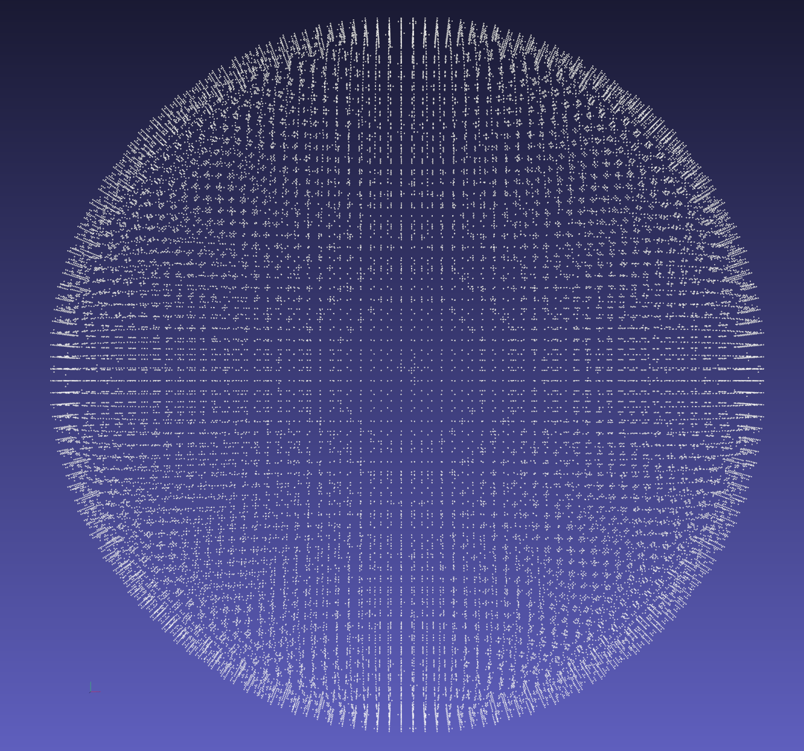 </td>
         <td>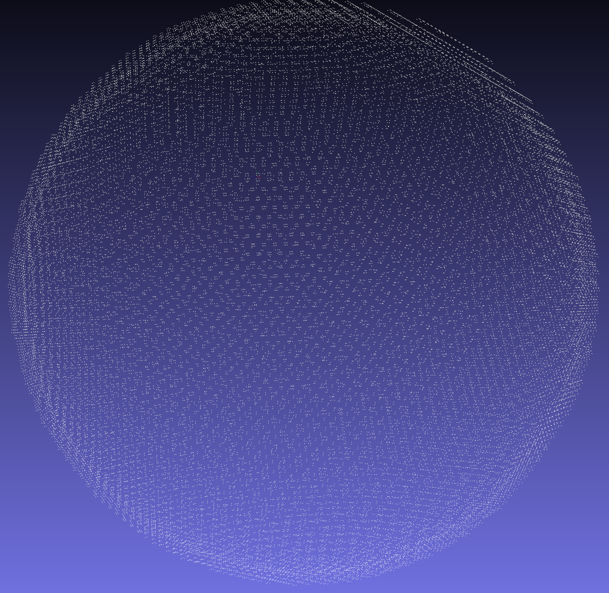 </td>
      </tr>
   </table>

## 1. Prerequisites
### 1.1 Dependencies
OpenCV 3.2.0, C++ 11 version

### 1.2. OpenCV Installation
Follow [OpenCV](https://docs.opencv.org/4.x/d2/de6/tutorial_py_setup_in_ubuntu.html)
- Install appropriate OpenCV version: [Here](https://sungjaeshin.github.io/O/opencv-install/).

## 2. Changing Parameters
### Parameters in "parameters.h"
```
// random grid (READ_FILE = 0) or read from file (READ_FILE = 1)
#define READ_FILE 1 

// Maximum Grid Size
#define GRID_MAX 400

// Number of Voxel  
#define NUM_VOXEL 400

// Set ISOVALUE
#define ISOVALUE 0.5
```

## 3. Descriptions
(1) Loopup Table from [http://paulbourke.net/geometry/polygonise/](    http://paulbourke.net/geometry/polygonise/) \
(2) save_ply.h from [https://github.com/nihaljn/marching-cubes/blob/main/src/utilities.cpp](https://github.com/nihaljn/marching-cubes/blob/main/src/utilities.cpp) \
(3) Input file format &rarr; `.ply` & `.txt` \
(4) If you don't have input files, then you can create random grid &rarr; `generate_random_grid()` in `utility.h` \
(5) Output file format &rarr; `.ply` & `.txt` \
(6) Visualized pointcloud or mesh &rarr; `viz3DMesh()` & `viz3DPoints()` in `viz_mesh.h` \
(7) Visualization python code also provided in `example` folder &rarr; `viz_ply.py` \
(8) Convert PLY format Binary to ASCII in `example` folder &rarr; `cvt_binary2ascii.py` 

## 4. Build and Run 
Clone the repository and build and run simultaneously:
```
   $ cd ${workspace}
   $ git clone https://github.com/SungJaeShin/Marching_cubes.git
   $ cd Marching_cubes
   $ sh start.sh
```

In `start.sh` file, **there must write the file (PLY or TXT) location and output file (PLY or TXT) location** !!
```
g++ ./src/main.cpp -L /usr/local/include/opencv2 -lopencv_viz -lopencv_highgui -lopencv_imgcodecs -lopencv_imgproc -lopencv_core -lopencv_features2d -o ./marching
./marching <INPUT_FILE_LOCATION> <OUTPUT_SAVE_LOCATION>
```

## 5. Setting Rules between Vertices and Edges !!
```

    Tables and conventions from
    http://paulbourke.net/geometry/polygonise/

       v4--------v5       *---e4---- *
      /|       / |      / |         /|
     / |      /  |     e7 |       e5 |
    /  |     /   |    /   e8     /  e9
  v7--------v6   |   *----e6---*     |
   |   |    |    |   |    |     |    |
   |  v0----|---v1   |    *---e0|--- *
   |  /     |  /     e11 /     e10  /
   | /      | /      |e3        | e1
   |/       |/       |/         |/
 v3--------v2        *---e2---- *


    Vertex : v0, v1, v2, v3, v4, v5, v6, v7
    Edge   : e0, e1, e2, e3, e4, e5, e6, e7, e8, e9, e10, e11

    Rules  : (1) find cubeIndex (using vertices) and make 16 bits number
             (2) find edgeIndex (using loopup table)
             (3) find edgePoints (using interpolation)
             (4) make triangles
```

## 6. Results 
- Time consumption
   - Example PLY: `sphere.txt` (# of pointcloud: 16926)
      <table>
         <tr>
            <td> NUM VOXEL </td>
            <td> # of triangles </td>
            <td> Pointcloud read time (ms) </td>
            <td> Voxel calculation (ms) </td>
            <td> Marching Cubes (ms) </td>
         </tr> 
         <tr>
            <td> 200 </td>
            <td> 68096 </td>
            <td> 9.54439 ms </td>
            <td> 0.684776 ms </td>
            <td> 272528 ms </td>
         </tr>
      </table>

- Marching cube results
   <table>
      <tr>
         <td> ISOVALUE </td>
         <td> -0.5 </td>
      </tr> 
      <tr>
         <td> 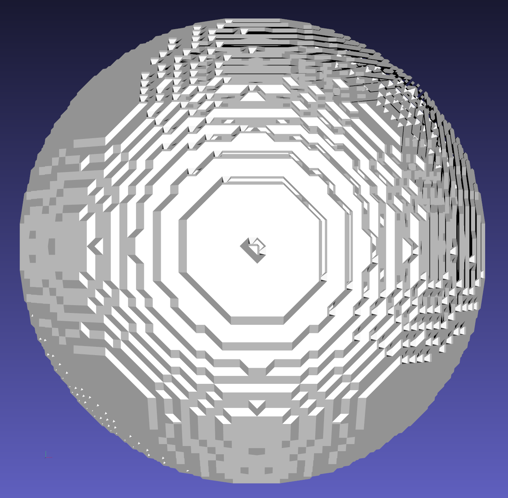 </td>
         <td> 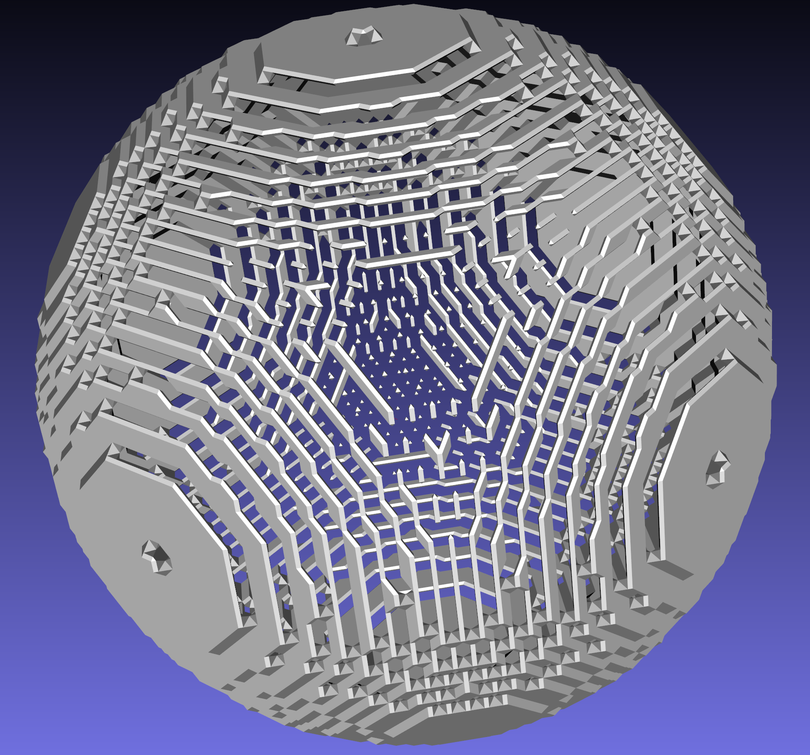 </td>
      </tr> 
      <tr>
         <td> ISOVALUE </td>
         <td> 0.5 </td>
      </tr> 
      <tr>
         <td> 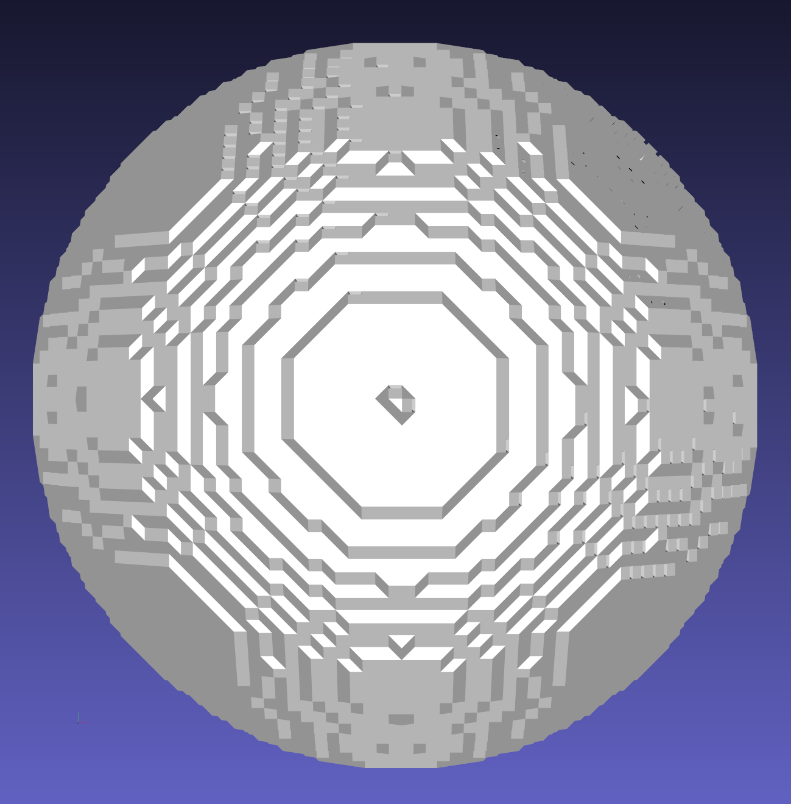 </td>
         <td> 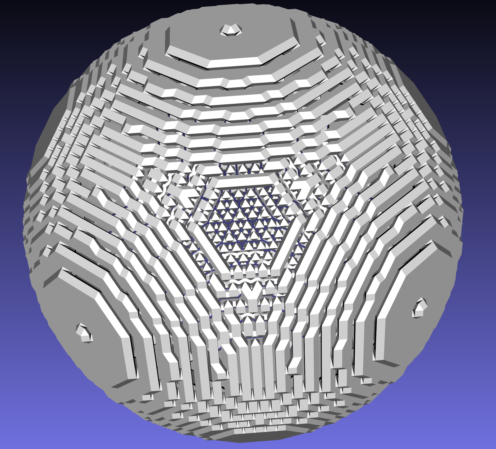 </td>
      </tr> 
      <tr>
         <td> ISOVALUE </td>
         <td> 1 </td>
      </tr> 
      <tr>
         <td> 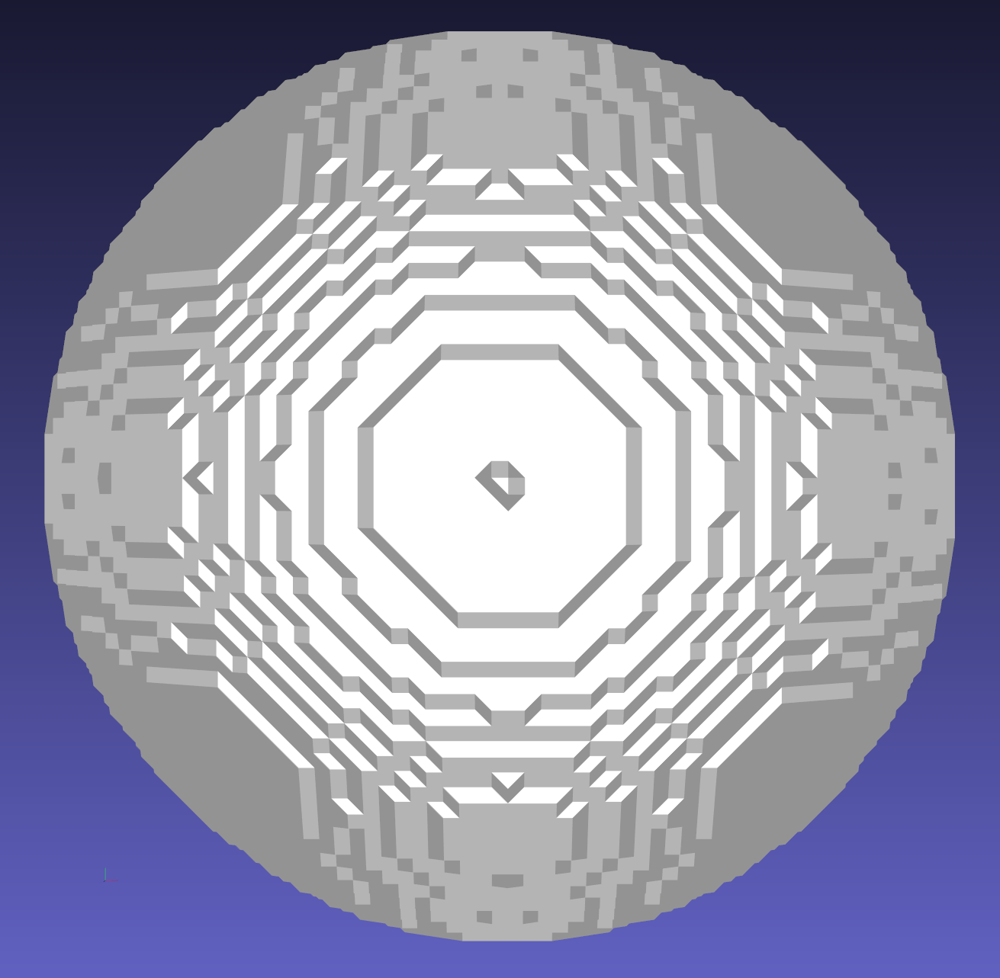 </td>
         <td> 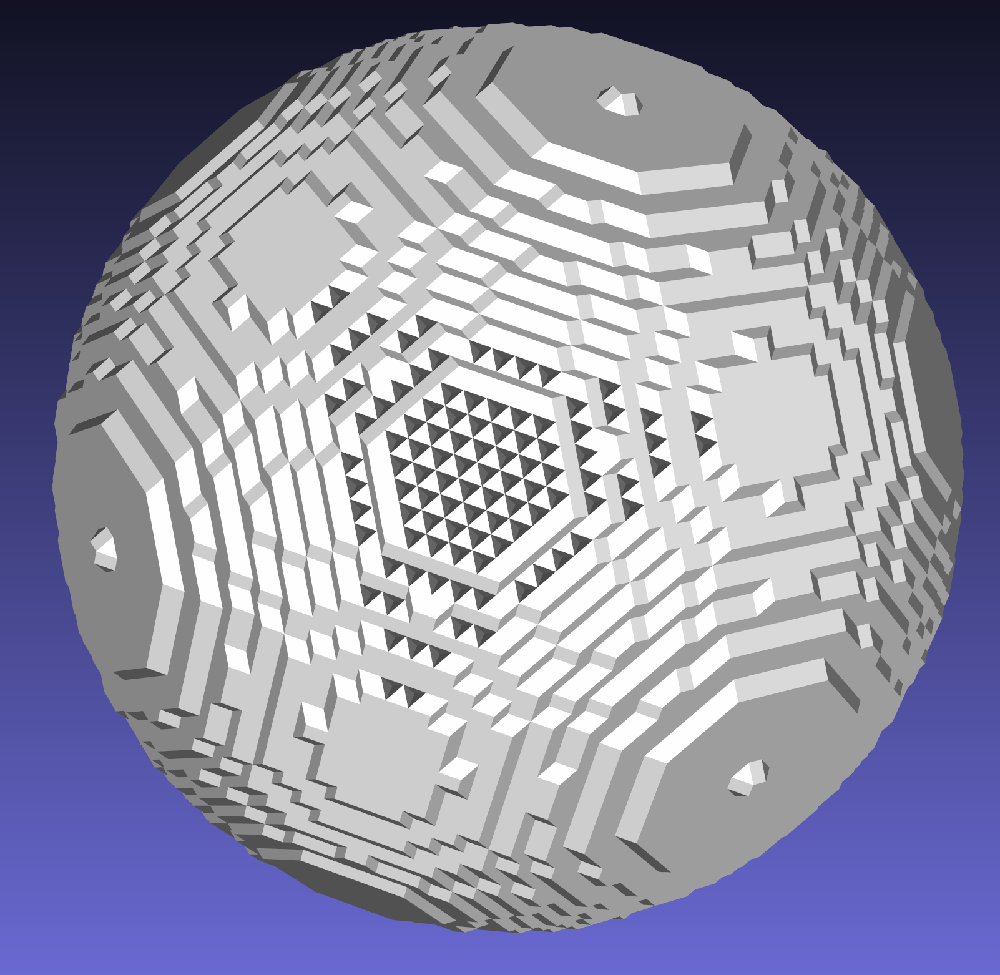 </td>
      </tr> 
   </table>

- Time Consumption of Random Grid Generation results (assume: `isovalue 0.5`)
   <table>
      <tr>
         <td> Density </td>
         <td> 1 </td>
         <td> random </td>
         <td> -1 </td>
      </tr> 
      <tr>
         <td> # of voxel </td>
         <td> 125000 </td>
         <td> 125000 </td>
         <td> 125000 </td>
      </tr> 
      <tr>
         <td> # of triangles </td>
         <td> 36064 </td>
         <td> 321827 </td>
         <td> 17368 </td>
      </tr>
      <tr>
         <td> Pointcloud read time (ms) </td>
         <td> 11.6072 </td>
         <td> 11.9498 </td>
         <td> 13.745 </td>
      </tr>
      <tr>
         <td> Voxel calculation (ms) </td>
         <td> 5.21115 </td>
         <td> 4.86867 </td>
         <td> 6.08164 </td>
      </tr>
      <tr>
         <td> Marching Cubes (s) </td>
         <td> 667.486 </td>
         <td> 701.606 </td>
         <td> 732.627 </td>
      </tr>
   </table>

- Marching cube results
   <table>
      <tr>
         <td> Density </td>
         <td> Results </td>
      </tr> 
      <tr>
         <td> 1 </td>
         <td> 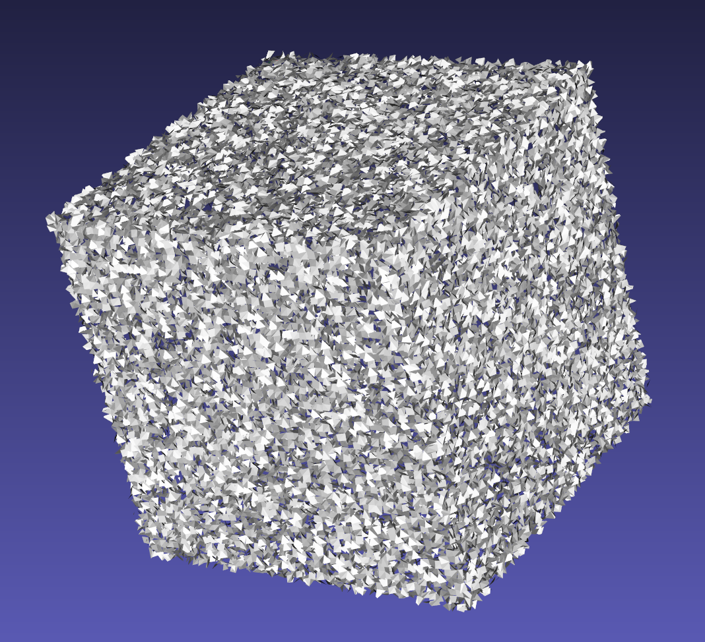 </td>
      </tr> 
      <tr>
         <td> random </td>
         <td> 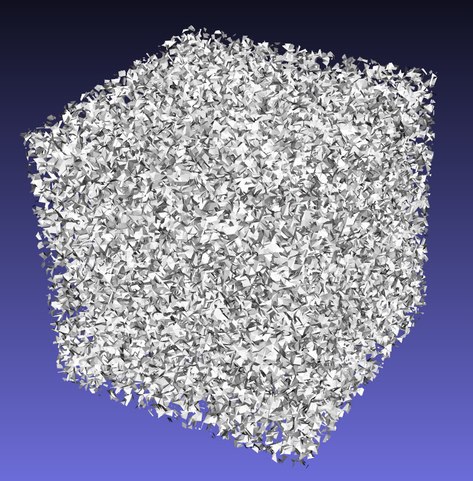 </td>
      </tr>   
      <tr>
         <td> -1 </td>
         <td> 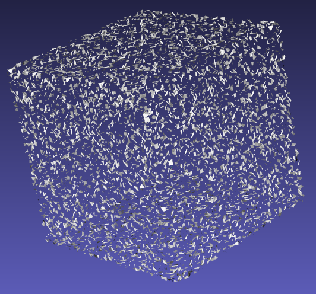 </td>
      </tr>
   </table>

## 7. References
[1] [https://github.com/nihaljn/marching-cubes](https://github.com/nihaljn/marching-cubes) \
[2] [https://www.volume-gfx.com/volume-rendering/marching-cubes/](https://www.volume-gfx.com/volume-rendering/marching-cubes/) \
[3] [http://www.it.hiof.no/~borres/j3d/explain/marching/p-march.html](http://www.it.hiof.no/~borres/j3d/explain/marching/p-march.html) \
[4] [https://paulbourke.net/geometry/polygonise/](https://paulbourke.net/geometry/polygonise/)

